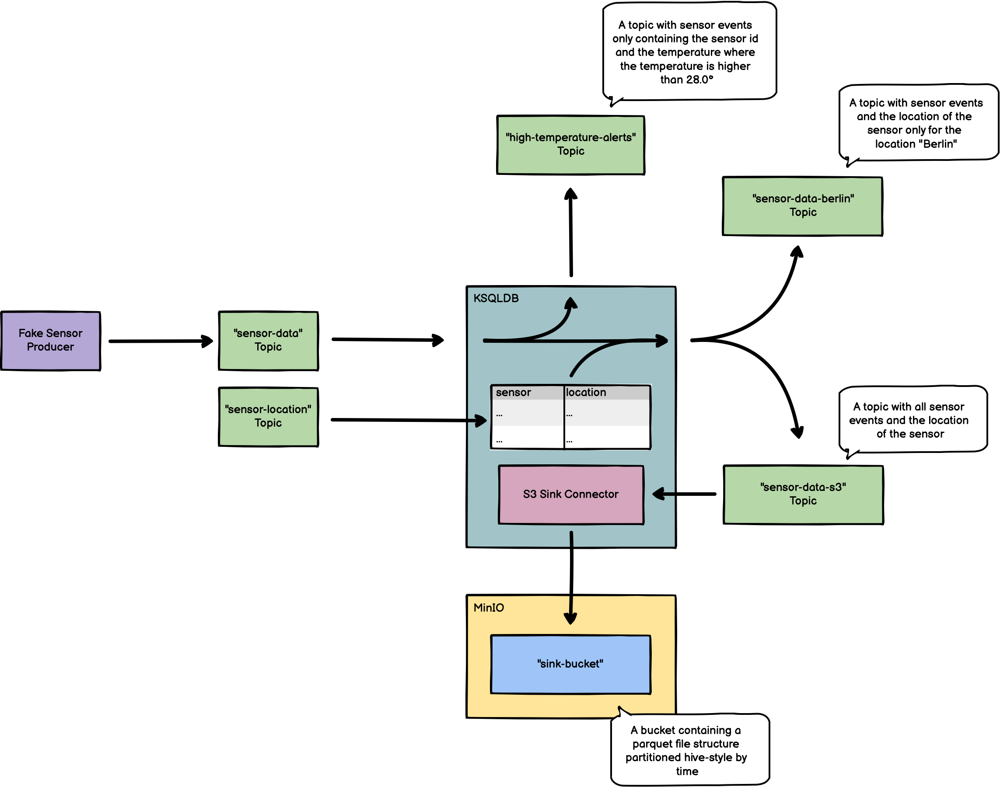

# ksqlDB Playground



## Setup

### Docker

```shell
docker compose up -d
```

### create venv

```shell
python3 -m venv .venv
source .venv/bin/activate
pip install -r requirements.txt
```

### start fake sensor generator

```shell
source .venv/bin/activate
python sensor.py
```

## Usage

### UIs

- [Kafka UI](http://localhost:8080)
- [MinIO UI](http://localhost:9001) (username: `admin`, password: `password`)
- [InfluxDB UI](http://localhost:8086) (username: `myusername`, password: `passwordpasswordpassword`)

### Endpoints

- Kafka: `localhost:29092`
- S3: `http://localhost:9000` (ACCESS_KEY: `admin`, SECRET_KEY: `password`, bucket: `sink-bucket`)
- InfluxDB: `http://localhost:8086` (token: `mytoken`, org: `myorg`, bucket: `mybucket`)
